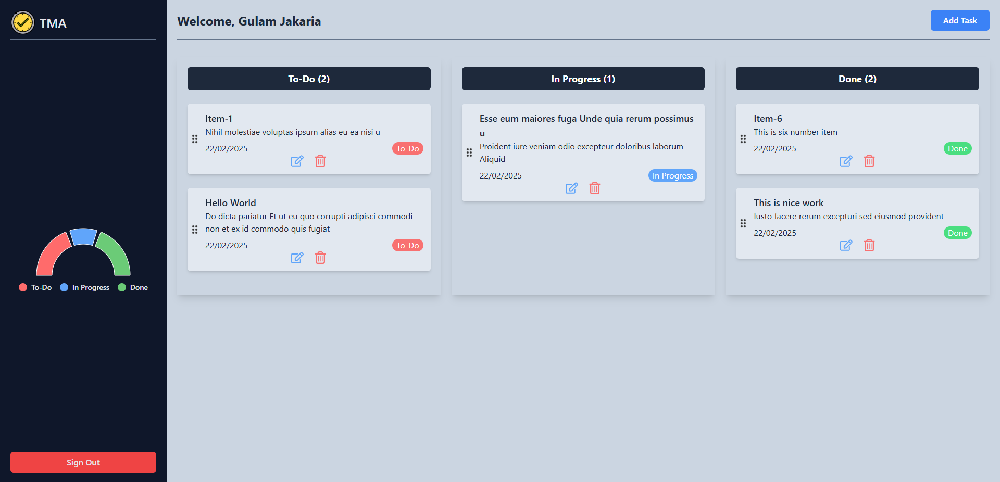

# Task Management App
A task management web application that allows users to create, update, and track their tasks efficiently.

## Live Link
[https://task-management-app-12bfd.web.app/](https://task-management-app-12bfd.web.app/home)


## Preview


## Key Features
✔️ User Authentication – Secure login and registration using Firebase Auth. <br />
✔️ Task Creation & Management – Users can add, edit, delete, and mark tasks as completed. <br />
✔️ Task Categorization – Organize tasks using categories like To-Do, In Progress, and Completed. <br />
✔️ Drag & Drop Functionality – Easily move tasks between different categories. <br />
✔️ Responsive UI – Fully optimized for desktop, tablet, and mobile using Tailwind CSS & DaisyUI. <br />


## Technologies Used
This project was built using the following technologies:
- **Frontend:** React, HTML, CSS
- **Styling:** Tailwind CSS, DaisyUI
- **Backend:** Node.js, Express.js
- **Database:** MongoDB
- **Firebase:** Firebase is used for authentication.
- **Hosting:** Firebase for client-side and Vercel for server-side

## **NPM Packages**
The following npm packages were used in the project:

- [`firebase`](https://www.npmjs.com/package/firebase): JavaScript library for Firebase services, including authentication and database.
- [`tailwindcss`](https://www.npmjs.com/package/tailwindcss): A utility-first CSS framework for creating custom designs.
- [`daisyui`](https://www.npmjs.com/package/daisyui): Component library for Tailwind CSS with a variety of pre-styled components.
- [`react-router-dom`](https://www.npmjs.com/package/react-router-dom): Declarative routing for React applications.
- [`react`](https://www.npmjs.com/package/react): A JavaScript library for building user interfaces.
- [`react-icons`](https://www.npmjs.com/package/react-icons): Popular icons as React components.


## Getting Started
Follow these steps to set up and run the project locally:

1. Clone the repository:
   ```bash
   git clone https://github.com/Jakaria030/task-management-app.git
   ```
2. Navigate to the project directory:
   ```bash
   cd task-management-app
   ```
3. Install dependencies:
   ```bash
   npm install
   ```
4. Run the development server:
   ```bash
   npm run dev
   ```
5. You have to setup some other things like firebase as per your need. Also you have to setup backend server. <br>
   Follow my server side github repository docs.
[Visit](https://github.com/Jakaria030/task-management-app-server)